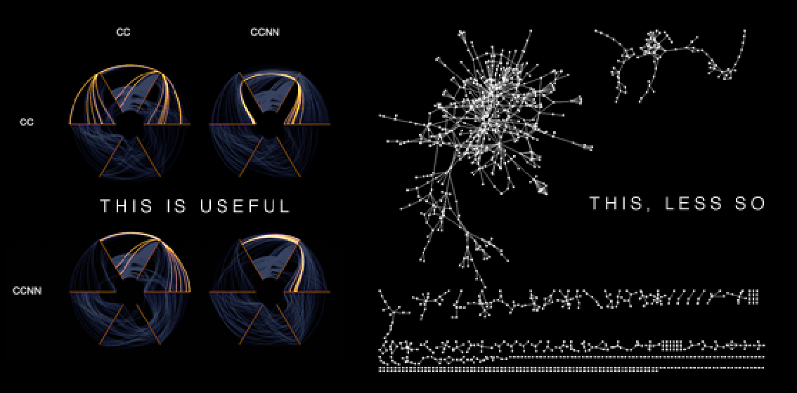

<!-- Limit image width and height -->

 
<!-- Center image on slide -->

## Analysis of Large Social Networks

 

* * * *
An Overview of Recent Developments
* * * *

 
 

<small>

Clarence Dillon

for _2014 MORS Symposium_, WG {29, 33}
</small>

*** = pnotes
This is also the time to introduce myself

---  

### Introduction

0. Utility of SNA
1. Current Tools and Methods
2. Problems at large-scale
3. Solutions at large-scale
4. New possibilities with large-scale soltuions

---  &vertical

### Concepts 

1. Networks as structure
2. Graph Theory as Math, Computation 
3. Problem at __scale__ and some solutions
4. Importance of small groups

***

### Networks as Structure

* Georg Simmel, "What is society" (Levine) [1]
* Identifying relationships 
 - between individuals 
 - between individuals and groups (bipartite networks)
 - between people and places (or things)
 - between ideas 
* Diads and Triads
* Multi-modal graphs show multiple types of relations

*** 

### Graph Theory as Math

* Graph as set of nodes (verteces) and edges
* "Bridges of Konigsberg", Euler and genesis of Graph Theory (Epp) [2]
* Determinate (typically) measures and metrics
 - Radius, average path, *etc*
 - Centrality (degree, Eigenvalue, ...)
 - Censuses and sub-graphs 
* Many metrics are "NP-Complete" or "NP-Hard" 
* Matches handily with other maths
 - sets
 - probabilistic graphical models 
 - semantics (propositional algebra)

***

### Problem of Scale

* Many network descriptions are easy
 - degree, censuses, shortest path, *etc*
 - average degree, centrality, *etc*
 - easily solved for 10<small>^7</small> nodes 
* Community detection is __much__ harder [3]
 - most methods are NP-Hard
 - difficult at 10<small>^3</small> 
 - nearly impossible at 10<small>^5</small> 
* But, there are currently $ >6x10 $ <small>^9</small> people
 - doesn't allow for global scale models of individuals
 - doesn't allow for people over time
 - doesn't allow for relationships between people and things, places, groups...

***

### Small groups

> Never doubt that a small group of thoughtful, committed citizens can change the world. Indeed, it's the only thing that ever has. [4]

* Social consensus through the influence of committed minorities [5]
* 

--- &vertical

### Current Tools

* Popular
 - NodeXL: Excel-based tool by UMUC
 - Gephi: Java-based tool, pretty viz
 - NetworkX: Python, R, ...
 - iGraph: Python, R, C++, ...
 - SNAP: Stanford, current gen 
* Becoming popular
 - GraphLab* (Python) by CMU
 - Pegasus (Java + Hadoop) 

<small>[*]GraphLab is really a machine learning tool, but it uses graphs </small>

***

### Community Detection Methods

* Edge Betweenness (top-down hierarchy)
* Fast-Greedy (bottom-up hierarchy)
* Walktrap (random walks of edges)
* Spinglass (Potts model, node state)
* Leading Eigenvector (top-down hierarchy)
* Label Propagation (CA)
* Infomap (random walk between nodes)

 
<small>Tamas Nepusz [6]</small>

--- 

### Problems at Large-scale

* Most community detection algorithms... 
 - walk the whole graph
 - not easy to parallalize
* Eliminates _typical big data_ solutions
 - Map-Reduce and elastic computing
 - GPU programming/CUDA
 - Multi-core processing
 - Super-computing
* Int'l Computing Workshop for WWW has held Large-Scale Network workshop only in 2012, 2013, 2014 

--- &vertical

### Solutions and Opportunities

* Parallelizable algorithms
* Graph databases/storage containers
* Improved vizualizations

***

### Algorithms adapted for Large-scale

* Top-down community detection 
 - each split spawns parallel process
 - edge betweenness, leading eigenvector 
* Random processes 
 - `itterations' performed in parallel
 - walktrap, spinglass, label prop, infomap
* Other, new solutions 
 - allowing overlap

***

### Rui Sarmento [7]

* 2013 Master's Thesis compared some solutions fir large-scale SNA
 - Hadoop, Green-Marl, Super-compute cluster (+)
 - Hadoop + Hadoop M-R + Pegasus or Giraph (0)
 - SNAP (-)
 - GraphLab (0)
* Parallel community detection
* Similarity ranking

***

### Alberto Ochoa, _et al_ [8]

* Betweenness Centrality by partitioning the graph
* Demographic zone identification (maximizing modularity)
* Cluster 'geographic units' based on demographic similarity

***

### Graph Databases and storage

* Graph databases contribute to parallelization
* Graph Databases
 - Cassandra
 - Neo4j
 - Mongo (document store)
* Stores
 - Sparksee (Dex)
 - GraphLab

***

### Hive Plot

* Martin Krzywinski (2011) [9]
* Combines graphs with parallel plots/line graphs
 - verices sorted along radial axes (typically by degree)
 - each axis represents a graph (edge attribute)
 - produces recognizable communities
* Easier to interpret than hairballs, censuses, subgraphs
* Can also be used for bi-modal/multi-modal networks

***

--- 

### Conclusion

* Good analysis of large networks is a problem worth solving
 - necessary for understanding global-scale social structures
 - may be useful for understanding global social change
 - not just about social networks 
* New research area for mathematicians and computer scientists
* Challenging the problem on multiple fronts
 - algorithms
 - graph storage
 - visualization

--- 

### References

<small>

1. Donald Levine, __Georg Simmel on Individuality and Social Forms__

2. Susanna Epp, __Discrete Mathematics with Applications__ 4^th ed.

3. [J. Leskovec, K. Lang, M. Mahoney, _Empirical Comparison of Algorithms for Network Community Detection_](http://cs.stanford.edu/people/jure/pubs/communities-www10.pdf)

4. Commonly attributed to Margarette Mead; disputed

5. [Xie, J. Sreenivasan, S. Korniss, G. _et al_, 2011](http://www.cs.rpi.edu/~szymansk/papers/pre.11.pdf)   

6. [Tamas Nepasz on Stackoverflow](http://stackoverflow.com/questions/9471906/what-are-the-differences-between-community-detection-algorithms-in-igraph)

7. [Rui Sarmento, __Thesis__ ](http://www.ruisarmento.com/uploads/Large_Scale_Social_Networks_Analysis_-_2013_-_Aftermath.pdf) 

8. [A. Ochoa, B. Bernabe, O. Ochoa, _Toward a Parallel System for Demographic Zonification based on Complex Networks_](http://www.journals.unam.mx/index.php/jart/article/view/17639)

9. [M. Krzywinski _Hive Plots_ ](http://egweb.bcgsc.ca/)

</small>

--- 

### Contact Info

* Graduate Student, Computational Social Sciences
* George Mason University, Krasnow Institute
* [C W Dillon](http://css.gmu.edu) at George Mason University, Krasnow Institute
* [cdillon2 at GMU](cdillon2@gmu.edu "this is my email address at GMU")

* * * * 

* Fast Forward Analytics, LLC
* [fastforwardanalytics.com](http://fastforwardanalytics.com)
* [cwdillon at fast forward analytics](cwdillon@fastforwardanalytics.com "this is my email address at Fast Forward Analytics")

